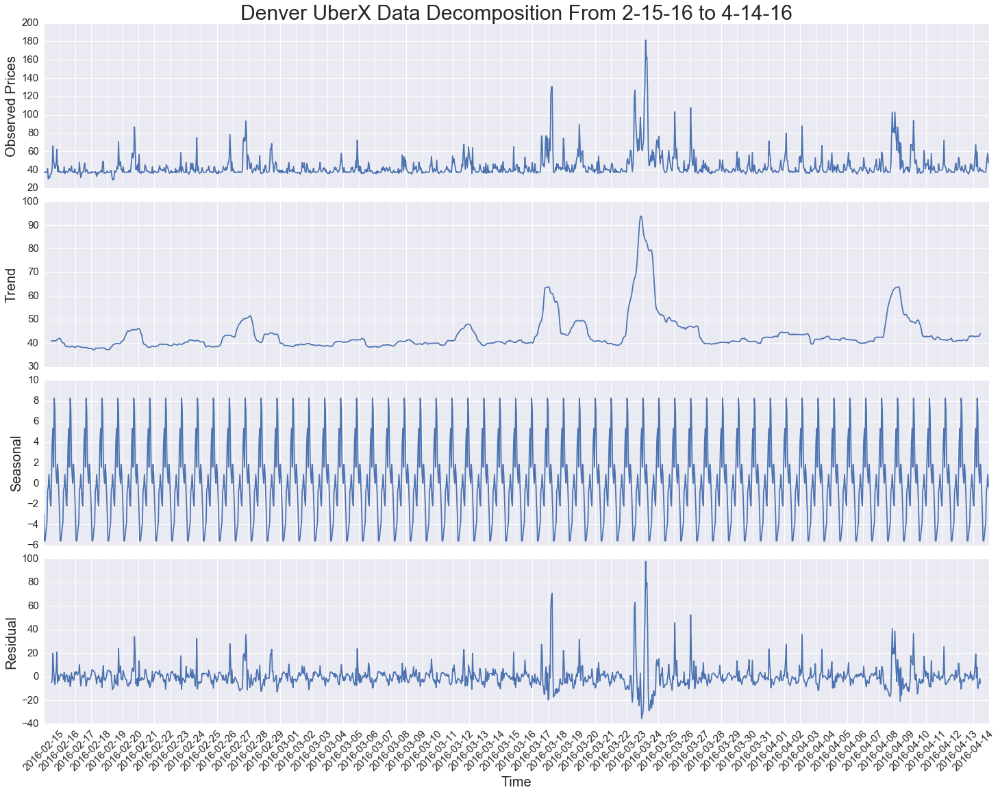
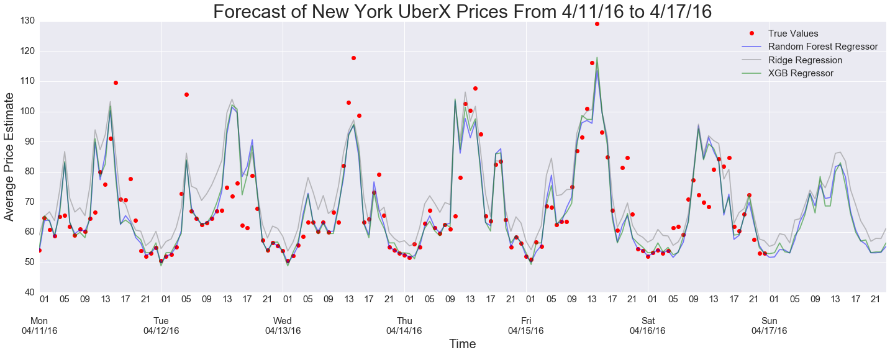
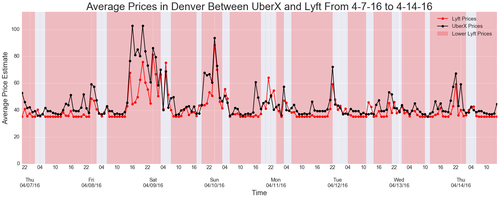

##Ride Share Air

Used ensemble methods to forecast average ride share prices for Uber and Lyft from downtown of several cities to the airport.

###Motivation

Currently, the ride sharing services do not provide a method to gain insight on prices into the future. Knowing these prices would allow customers to plan their trips accordingly.

###Overview

Data was collected from Uber and Lyft API for Denver, Seattle, Chicago, San Fransisco, and New York at a minute interval for pricing information from the downtown of the city to the airport. Because of the natural of the data collection interval, an AWS EC2 instance was instantiated to continuously request data from the APIs.  

###Data

Fortunately, most of the data that arises from APIs is relatively clean and well documented. The trouble is organizing all of the data from JSON documents into structured DataFrame. Periodically, the dataset would be need to be updated since there was always new data streaming in.

Forecasting prices is a challenging task. In order to build an accurate model that would be able to forecast ride sharing prices, there were many patterns in the time series analysis that needed to be captured. A majority of the time was spent conducting exploratory data analysis to uncover seasonality, trends, and cyclic patterns.

###Validation

Unfortunately for time series analysis, there is not a built-in functionality to conduct cross-validation. In time series analysis, each observation is not independent of one another. Accounting for the number of lags or intervals of observations that were necessary to construct a model that would yield the lowest MSE.

Ensemble methods, ARIMA, and Multiple Regression models were tested to see which would forecast the prices most accurately. Through cross-validation MSE, Random Forest Regressor proved to be the model that worked the best.

###Hurdles

The biggest challenge coming into this project was the time constraint on data collection. Since the data needed to be gather consistently, there would be limitations on how much seasonal patterns and trends would be captured. In particular, the Lyft API was just launched last March, therefore, the long-term functionality of the forecast model based on current data is unknown.

